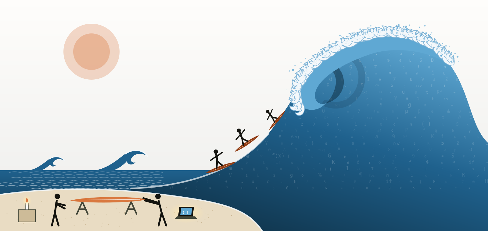
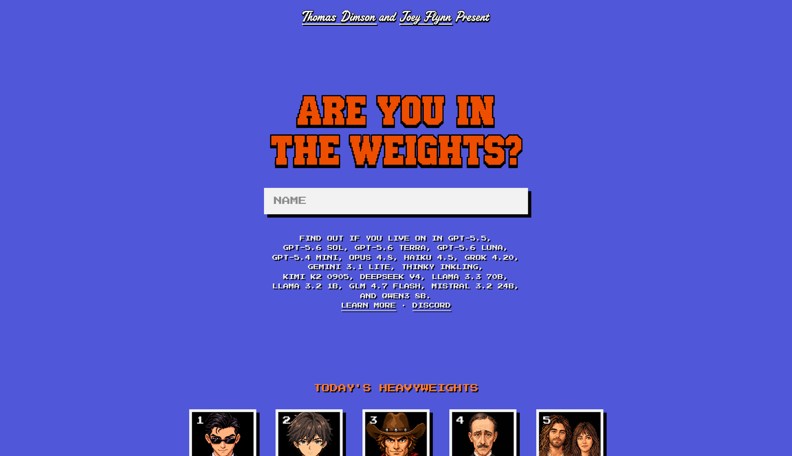

## AI is like a… {#ai-is-like}

<span class="time-mark">0:00</span>

> **"AI is like a \_\_\_\_\_\_\_\_\_\_\_\_\_\_\_\_"**

. . .

Take **two minutes**. Write down **three** metaphors or analogies for what AI is *to you*.

. . .

::: {.key-insight}
How we *picture* AI quietly decides what we think it can do for us.
:::

::: {.notes}
0:00. Open cold with this. No title slide talk. Before names, before agenda.
Say: "Before anything else — finish this sentence three ways. Not the right answer; your answer."
Give a full two minutes of quiet. Don't share yours yet: you present it on its own slide after theirs (0:14).
Watch: someone stuck → "what do you reach for it to do?"
:::

## Introductions, through your metaphors

<span class="time-mark">0:03</span>

Around the room, please share:

1. **Your name**, where you're from, and your research area
2. **How you use AI** today — work, life, both
3. **Your three metaphors** (we'll write them up)
4. **What you'd like to walk out with** today

::: {.notes}
0:03–0:13. Five attendees, about two minutes each. Write every metaphor into the table on the next slide (chalkboard, or type into your speaker copy).
Yours comes after theirs, on its own slide.
Listen for: tool metaphors (search engine, calculator), agent metaphors (intern, colleague), medium metaphors (lens, translator). You'll use these categories next.
Also ask each for their readiness-report "mode" (A local / B connected / C chat-only) from the pre-work prompt — note it on the run-sheet; it decides who you help first in Hands-on 1.
:::

## Our metaphors

<span class="time-mark">0:13</span>

::: {.metaphor-table}
| Who | AI is like… | …and like… | …and like… |
|---|---|---|---|
| | | | |
| | | | |
| | | | |
| | | | |
| | | | |
:::

::: {.notes}
0:13. Fill as people speak (chalkboard: press C; or edit the .qmd live before the session ends — the deck is the record).
Keep this table: we come back to it at 3:48. Then: “Here is mine.”
:::

## My answer {.alchemy background-color="#14140f"}

::: {.alchemy-quote}
**AI is intellectual alchemy:** the transmutation of accumulated human symbols into new forms of cognition, agency, and world-making.
:::

::: {.notes}
0:14–0:16. Let it sit. Read it once, slowly, then stop talking for a beat.
Unpack the three phrases if asked: *accumulated human symbols* (everything we have written, counted, coded); *transmutation* (not retrieval: something new is made from them); *cognition, agency, world-making* (it reasons, it acts, it changes what is possible).
Bridge: "Alchemy promised to turn the common into the precious. This turns something precious into something common."
:::

## What was scarce becomes abundant

<span class="time-mark">0:16</span>

::: {.columns}
::: {.column width="48%"}
**For all of history**

**Intelligence** — the capacity to reason, analyze, write, explain — has been **scarce**.

Careers, institutions, and dissertations are built on that scarcity.
:::
::: {.column width="4%"}
:::
::: {.column width="48%"}
**Now**

AI makes intelligence **abundant**.

That is a **disruptive innovation** for intelligence workers.

*That is us.*
:::
:::

::: {.notes}
0:16–0:18. The scarcity point, plainly. Disruptive innovation in Christensen's sense: what was costly and rare becomes cheap and everywhere, and the work organised around its scarcity has to change.
Don't sell fear. Name it, then turn: the next slide is what we do about it.
:::

## The wave, and our surfboards {.wave}

{fig-alt="A towering wave, its body made of letters, numerals, mathematical signs and code, curls over a calm sea. Small figures ride its face on copper surfboards. On the shore, two people shape a new surfboard beside a glowing laptop, while a single candle burns on a crate."}

[AI is a fast-approaching tsunami. We are building **surfboards** — with AI — to ride it.]{.wave-caption}

::: {.notes}
0:18–0:20. The wave is made of our own symbols: letters, numbers, mathematics, code. That is the alchemy slide, drawn.
Point to the shore: the candle is how intelligence used to be (scarce, small, precious). The two people with the laptop are us today: shaping a board, with the AI beside us.
"Your dissertation repository is a surfboard. You leave today with one, and you'll know how to shape it."
:::

## What our metaphors do to us

<span class="time-mark">0:20</span>

::: {.columns}
::: {.column width="50%"}
**Limiting pictures**

- "a search engine" → ask a question, take an answer
- "a calculator" → expect one right output
- "a robot" → issue commands
:::
::: {.column width="50%"}
**Expansive pictures**

- "a collaborator" → iterate together
- "a lens" → see your own work differently
- "a medium" → new forms of expression
:::
:::

. . .

::: {.key-insight}
Today we treat AI as a **medium for transmitting what you know** — and as a collaborator in building it, never its author.
:::

::: {.notes}
0:20–0:22. Map the room's metaphors onto the two columns — point at the table. No judgment: limiting pictures aren't wrong, they're narrow.
Bridge: the rest of the day is practice at the expansive end.
:::

## Ask your AI the same question

<span class="time-mark">0:22</span>

Open your AI and ask:

> *"Finish this sentence three ways, honestly: 'AI is like a…'. Then tell me which of those pictures would make me use you badly."*

. . .

We'll compare answers — and keep them. We come back to *all* of these at the end.

::: {.notes}
0:22–0:25. This doubles as a tool check: anyone whose AI isn't working surfaces now, not at 1:10. Note them for the run-sheet.
Take two or three readouts. Funny ones are fine.
:::

## Today

<span class="time-mark">0:25</span>

| Time | Block |
|---|---|
| 0:00 | **AI is like a…** and introductions |
| 0:25 | **Why** — the dissertation as a way of transmitting knowledge |
| 0:45 | **What you'll build** — your dissertation as a platform |
| 1:05 | **Hands-on 1** — create your dissertation and meet your repository |
| 1:50 | *Break* |
| 2:05 | **Hands-on 2** — build your knowledge base; write → render → review |
| 2:55 | **Hands-on 3** — publish |
| 3:20 | **The harness is yours** — making the AI work your way |
| 3:40 | Ethics, attribution, what's next · Q&A |

About half of today is **hands-on, on your own dissertation**.

::: {.notes}
0:25. Thirty seconds. The handout follows this exactly; point to it (link in the footer of the site).
:::

# Why {.section-title background-color="#434739"}

[Part I]{.eyebrow}

*What is a dissertation, really?*

::: {.notes}
0:25–0:45: condensed history. Keep it moving — it's the "why", not a lecture.
:::

## A question worth asking

::: {.key-insight}
What **is** a dissertation?
:::

. . .

At its core: a **technology for moving understanding from one mind to others**.

. . .

Like every technology, it has changed. Less than we think.

::: {.notes}
0:26. Let the question sit for a beat before revealing.
:::

## Six centuries, one modality

```{mermaid}
%%| fig-cap: "From oral disputation to the PDF, reach widened but the mode stayed: one human writes, one human reads."
%%{init: {'theme': 'base', 'htmlLabels': false, 'themeVariables': {'fontSize': '26px', 'fontFamily': 'Helvetica Neue, Arial, sans-serif', 'primaryColor': '#f0f1ed', 'primaryBorderColor': '#434739', 'primaryTextColor': '#14140f', 'lineColor': '#434739'}, 'flowchart': {'htmlLabels': false, 'padding': 24, 'nodeSpacing': 60, 'rankSpacing': 70}}}%%
flowchart LR
  A["Oral disputation<br/>one → few"] --> B["Manuscript<br/>one → few"]
  B --> C["Printed thesis<br/>one → many"]
  C --> D["PDF<br/>one → many, faster"]
```

- **Oral** (pre-1200s): knowledge lived in people; died with them
- **Medieval university**: *lectio, quaestio, disputatio* — the thesis as a proposition to defend
- **Print** (1450s→): reproducible, asynchronous — changed the **reach**, not the **modality**
- **PDF** (1990s→): global — but a digital photocopy; data and code "available upon request"

::: {.notes}
0:28–0:34. One line per era; the slide carries the detail. Land on the PDF bullet.
:::

## We digitized the container

::: {.key-insight}
We digitized the **container**, not the **knowledge**.
:::

. . .

In every era: **one human writes → one human reads**, in linear text.

What if that is no longer the only option?

::: {.notes}
0:34. Pause on the key line. Ask the room: "Who reads your dissertation today besides your committee?" (Often: nobody. That's the point.)
:::

## The shift

::: {.key-insight}
For the first time, the **consumers** of research are not exclusively human.
:::

. . .

- **AI agents** read, summarize, and reason about research — and can act on it
- **Structured sources** (a specification, a knowledge base) make research *addressable*, not just readable
- **Applications** let non-specialists explore findings themselves
- **Version control + automation** make every number reproducible on demand

::: {.notes}
0:36–0:40. Connect to their metaphors: a "medium" picture of AI fits this shift; a "search engine" picture doesn't.
:::

## Relevance, when the readers are machines {.relevance}

<span class="time-mark">0:40</span>

::: {.columns}
::: {.column width="56%"}
{fig-alt="The landing page of intheweights.com: the headline 'Are you in the weights?', a name field, and the list of AI models it checks, above a row of today's top-ranked names." .bordered}

[*Are you in the weights?* — [intheweights.com](https://intheweights.com/), Thomas Dimson & Joey Flynn]{.source}
:::
::: {.column width="44%"}
**"In the weights"**: a model recalls you *without searching the web*. A kind of fame that lives as long as the model does.

::: {.fragment}
For a scholar, **relevance** now has a second audience:

- Is your work *in the weights* — or easy for an AI to find, read and cite **correctly**?
- A PDF behind a login is close to **invisible** to it.
:::

::: {.fragment .small}
The site is a toy: its scores are uncalibrated, and models invent biographies. Being recalled is not being **right**.
:::
:::
:::

::: {.notes}
0:40–0:42. Show the site; if Wi-Fi allows, type a famous name live (not an attendee's, unless they ask).
The point: relevance used to mean being read and cited by people. Now it also means being legible to the models that read for people. What gets into the weights is decided by what was public, plentiful and well-linked.
Bridge to the next slide: "So how do you make your dissertation legible to both? One source, many channels."
Caveat honestly: it's a novelty measure (uncalibrated confidence, hallucinated details). Don't chase the score; publish so that what is learned about you is correct.
:::

## One source, many channels

```{mermaid}
%%| fig-cap: "Author once; transmit to every audience from the same source."
%%{init: {'theme': 'base', 'htmlLabels': false, 'themeVariables': {'fontSize': '26px', 'fontFamily': 'Helvetica Neue, Arial, sans-serif', 'primaryColor': '#f0f1ed', 'primaryBorderColor': '#434739', 'primaryTextColor': '#14140f', 'lineColor': '#434739'}, 'flowchart': {'htmlLabels': false, 'padding': 24, 'nodeSpacing': 60, 'rankSpacing': 70}}}%%
flowchart TB
  S["Your dissertation<br/>authored once"]
  S --> H["Committee and readers<br/>thesis PDF · website"]
  S --> K["You and your AI<br/>knowledge base"]
  S --> V["Everyone else<br/>an app on the open web"]
  S --> A["AI agents<br/>queryable tools · coming"]
```

::: {.key-insight}
The dissertation stops being only a document. It becomes a **platform**.
:::

::: {.notes}
0:42–0:45. Be honest about the fourth branch: today you'll build the first three for real; the AI-agent channel is where this goes (we'll show it at 3:20).
:::

# What you'll build {.section-title background-color="#434739"}

[Part II]{.eyebrow}

*Your dissertation as a platform — today*

::: {.notes}
0:45–1:05. Architecture as it actually ships. Everything on these slides is in the repository they'll have in 30 minutes.
:::

## From your answers to your repository

```{mermaid}
%%| fig-cap: "The hub turns your interview answers into a specification and provisions your repositories; you clone them and point your own AI at them."
%%{init: {'theme': 'base', 'htmlLabels': false, 'themeVariables': {'fontSize': '26px', 'fontFamily': 'Helvetica Neue, Arial, sans-serif', 'primaryColor': '#f0f1ed', 'primaryBorderColor': '#434739', 'primaryTextColor': '#14140f', 'lineColor': '#434739'}, 'flowchart': {'htmlLabels': false, 'padding': 24, 'nodeSpacing': 60, 'rankSpacing': 70}}}%%
flowchart LR
  P["Your pre-work<br/>answers"] --> I["dissertation.ai<br/>interview"]
  I --> S["dataimago-spec.yaml<br/>the contract"]
  S --> R1["Your dissertation repo"]
  S --> R2["Your R package repo<br/>if you have one"]
  R1 --> C["Your computer<br/>with your AI"]
  R2 --> C
```

- **dissertation-ai.dataimago.ai** asks the questions from your pre-work
- It writes a **specification** — a plain-text file you can read and edit
- It creates your repositories on **your** GitHub account. They are yours.

::: {.notes}
0:46. Emphasize ownership: nothing lives on our servers except the moment of creation; the repos are theirs, private if they choose.
:::

## What's in your repository

| Where | What it is | Who writes it |
|---|---|---|
| `dataimago-spec.yaml` | The contract: who, what, how | You (the interview drafted it) |
| `raw/` | Your sources — papers, data, drafts, guidelines | You. **Read-only for the AI** |
| `wiki/` | The knowledge base built from `raw/` | Your AI, with you |
| thesis chapters | The dissertation itself (Quarto) | **You**, with AI as collaborator |
| `AGENTS.md`, `.claude/` | The **harness** — rules and skills for any AI | Shipped; **you** customize |
| the app | A website for your dissertation (Next.js) | Generated; you deploy |

::: {.notes}
0:48–0:52. Walk the table top to bottom. The right-hand column is the ethics of the whole thing in miniature: who writes what.
:::

## A working vocabulary

::: {.columns}
::: {.column width="50%"}
- **Prompt** — what you give the AI
- **Context** — what it can *see* at once; its working memory
- **Agent** — an AI that takes *actions*: reads files, runs commands
- **Harness** — the rules, tools, and context around the model (Claude Code, Codex, opencode, Cursor are harnesses)
:::
::: {.column width="50%"}
- **Repository** — a folder tracked by git, with full history
- **Branch / pull request** — a proposed change you review before it lands
- **Render** — turn source into output (Quarto: `.qmd` → website, PDF)
- **MCP** — a standard plug between AIs and tools
:::
:::

::: {.key-insight}
You don't need to memorize these. They'll be natural by lunch.
:::

::: {.notes}
0:52–0:56. Fast. The one to dwell on is "harness": the model is the engine; the harness is the car — and today you'll see the harness is also *yours to modify*.
:::

## The discipline

::: {.key-insight}
**Leave the plumbing to the AI. Own the content.**
:::

- Your research questions, analysis, interpretation, and prose remain **your** responsibility
- What the system derives on your behalf — the spec, the scaffolding, the knowledge base, suggested text — is **inspectable, contestable, exportable**
- AI is a **collaborator and an access layer — never an author**

::: {.notes}
0:56–1:00. This is the frame for every hands-on block. When something goes wrong today, the question is always "is this plumbing (let the AI fix it) or content (that's yours)?"
:::

## Your three ways of working

From your pre-work readiness report:

| Mode | You have… | Today you… |
|---|---|---|
| **A — local** | an AI that edits files and runs `git` on your machine | do everything in your repo directly |
| **B — connected** | an AI connected to GitHub | work through pull requests |
| **C — chat-only** | a chat AI, no file access | paste files in, paste changes back — same results, more copying |

All three get to the same place.

::: {.notes}
1:00–1:05. Quick show of hands per mode. Pair a Mode-C attendee with a Mode-A neighbor if the room allows.
:::

# Hands-on 1 {.section-title background-color="#913d15"}

[1:05 – 1:50]{.eyebrow}

*Create your dissertation and meet your repository*

::: {.notes}
Goal: everyone leaves this block with (1) their repository on GitHub, (2) a local clone their AI can see, (3) one merged-or-open pull request.
:::

## Step 1 — Create your dissertation

::: {.hands-on}
1. Open **dissertation-ai.dataimago.ai** → **Begin**
2. Answer from your **pre-work** document (ask your AI to help you transfer answers)
   - Filled in the JSON template? Use **Import JSON** at the top right
3. **Sign in with GitHub** when asked
4. On **Review your answers**: check the plan — repository names, **public or private**
5. **Generate my dissertation**
:::

::: {.small}
Private keeps unpublished work private. Public lets your sites publish on GitHub's free plan. You can change it later.
:::

::: {.notes}
1:05–1:25. Circulate. Expect:
- "documents still need a file" notice: the documents they listed but didn't attach → "Generate without them" is fine; attach later.
- a name already taken: the hub now stops with "Nothing was created" and focuses the rename field / jumps to the package-name question.
- Private chosen: the done page explains why there are no website links.
The done page lists the repositories, where it publishes, and next steps. Have them keep that tab open.
:::

## Step 2 — Clone it and point your AI at it

::: {.hands-on}
```bash
cd ~/Dissertation
git clone --recursive https://github.com/<you>/<your-repo>.git
```

Then paste the **"Get to know your repo"** prompt (handout) into your AI.
:::

It will read `README.md`, `AGENTS.md`, `dataimago-spec.yaml`, `raw/README.md` — and tell you, in five lines, what's there and **the rules it must follow**.

::: {.notes}
1:25–1:35. `--recursive` pulls in the linked R package if they have one; harmless otherwise. Mode B: connect the one repository only. Mode C: they paste the four files.
Ask one or two people to read their AI's "rules" summary aloud. It should mention: branches/PRs, raw/ read-only, LOCKED.md, no secrets/personal data, warn if public + unpublished.
:::

## Step 3 — Your first pull request

::: {.hands-on}
Ask your AI to:

1. create a branch
2. add one line to `writing/setup-check.md` — *"Setup check — today's date"*
3. commit, push, and **open a pull request**
4. explain how *you* review and merge it
:::

Then **you** merge it on GitHub.

::: {.notes}
1:35–1:45. The point isn't the line of text; it's the loop: the AI proposes, the author reviews and decides. Every change today follows that loop.
Mode C: walk through the same on github.com.
:::

## Checkpoint

::: {.checkpoint}
- ☐ Your repository exists on GitHub
- ☐ Your AI can see your clone (or you can paste to it)
- ☐ One pull request — opened by your AI, merged by **you**
:::

::: {.notes}
1:45–1:50. Hands up for each box. Anyone short: pair them, or use the fallback (run-sheet) so they keep up after the break.
:::

# Break {background-color="#ededeb"}

[1:50 – 2:05]{.eyebrow}

::: {.notes}
Use the break to unstick anyone who missed the checkpoint.
:::

# Hands-on 2 {.section-title background-color="#913d15"}

[2:05 – 2:55]{.eyebrow}

*Build your knowledge base · write → render → review*

::: {.notes}
Goal: (1) a knowledge base the AI built from their own sources — and that they've checked; (2) one chapter section drafted, rendered, reviewed.
:::

## Context compounds

::: {.key-insight}
An AI is only as useful as what it can see. Your sources become the **context** it works from — every session, not just this one.
:::

- `raw/` holds what you brought: papers, your advisor's work, style exemplars, data descriptions, formatting rules
- **`/ingest`** reads it all and builds `wiki/`: one page per source, synthesis pages, and a report of **what it read, what it inferred, and what's missing**
- Brought a **finished dissertation**? `/import-manuscript` turns it into editable chapters — **version 1.0, locked**

::: {.notes}
2:05–2:10. This is the pre-work paying off: the answers and documents they gave are now the AI's context.
:::

## Build it — in any AI tool

::: {.hands-on}
- **Claude Code:** run `/ingest`
- **Codex, opencode, Cursor, ChatGPT with folder access:**
  *"Read `.claude/skills/ingest/SKILL.md` and follow it step by step."*
- **Chat-only:** follow the handout's paste-in version
:::

::: {.small}
Dropped a whole folder? Copy it into `raw/inbox/` first. It is never committed until `/ingest` has sorted it, and anything with names or addresses goes to `raw/private/`, which git never sees.
:::

::: {.notes}
2:10–2:25. Ingest can take a while on a big folder: start it, let it run, move on in parallel (Step "contest it" can wait). Empty raw/ is fine: it builds from the spec.
Watch for: an AI that wants to edit raw/ files — stop it; that's the rule.
:::

## Contest it

The ingest report says what the AI **read**, **inferred**, and **couldn't** read.

::: {.hands-on}
Open the report and pick **one** claim the AI made about your work.

- Is it **correct**? **Wrong**? **Needs you**?
- Correct it — in your own words — and ask your AI to update the page
:::

::: {.key-insight}
The knowledge base is yours. The AI drafted it; **you** decide what's true in it.
:::

::: {.notes}
2:25–2:30. This is the agency moment. The skill is noticing — the AI is confident whether right or wrong.
:::

## The core loop

```{mermaid}
%%| fig-cap: "Write with your AI, render the output, review it as a reader would — and go round again."
%%{init: {'theme': 'base', 'htmlLabels': false, 'themeVariables': {'fontSize': '26px', 'fontFamily': 'Helvetica Neue, Arial, sans-serif', 'primaryColor': '#f0f1ed', 'primaryBorderColor': '#434739', 'primaryTextColor': '#14140f', 'lineColor': '#434739'}, 'flowchart': {'htmlLabels': false, 'padding': 24, 'nodeSpacing': 60, 'rankSpacing': 70}}}%%
flowchart LR
  W["Write<br/>you + your AI"] --> R["Render<br/>quarto preview"]
  R --> V["Review<br/>as a reader"]
  V --> W
```

You iterate on **content**, not infrastructure. You keep full editorial control.

::: {.notes}
2:30. Brief. Then straight into the exercise.
:::

## Write → render → review

::: {.hands-on}
Pick one section — the opening of your introduction is a good start.

1. Ask your AI to **read `writing/STYLE.md` and your knowledge base**, then draft or revise the section **with you** — show you the change, don't silently rewrite
2. **Render** it: from your thesis folder (`thesis/`, or your package's `ui/www/`), run `quarto preview`
3. **Review** it as your committee would. Push back. Go round again.
:::

::: {.small}
Finished dissertation imported? The originals in `raw/manuscript/` are locked: extend, never regenerate.
:::

::: {.notes}
2:30–2:50. Circulate and look for: AI rewriting voice → coach the "show me the change" prompt; preview errors → usually a missing package/font: plumbing, let the AI fix it.
:::

## Prose that can't drift from the numbers

```markdown
Reading scores recovered after 2020, reaching a mean of
`r summarize_scores("READING", year = 2023)$mean` by 2023.
```

When the data or the code changes, **the number in your sentence changes with it**. No transcription, no stale tables.

::: {.small}
*Illustrative:* `summarize_scores()` stands for a function in your own R package; it is not shipped with the template.
:::

::: {.notes}
2:50–2:55. Demo only (cut if behind). Show it in your own instance if time. `summarize_scores()` is a made-up example — say so. The idea: reproducibility underwrites the validity of every reported number.
:::

# Hands-on 3 {.section-title background-color="#913d15"}

[2:55 – 3:20]{.eyebrow}

*Publish*

::: {.notes}
Goal: something of theirs live on the open web — the app on Vercel, and (public repos) the sites on GitHub Pages; the thesis PDF built by Actions.
:::

## Push, and let the robots work

```{mermaid}
%%| fig-cap: "A push triggers the builds; the outputs land where readers can reach them."
%%{init: {'theme': 'base', 'htmlLabels': false, 'themeVariables': {'fontSize': '26px', 'fontFamily': 'Helvetica Neue, Arial, sans-serif', 'primaryColor': '#f0f1ed', 'primaryBorderColor': '#434739', 'primaryTextColor': '#14140f', 'lineColor': '#434739'}, 'flowchart': {'htmlLabels': false, 'padding': 24, 'nodeSpacing': 60, 'rankSpacing': 70}}}%%
flowchart LR
  P["git push"] --> GA["GitHub Actions"]
  GA --> PDF["Thesis PDF<br/>docs/thesis.pdf"]
  GA --> KB["Knowledge site<br/>GitHub Pages"]
  P --> VC["Vercel"]
  VC --> APP["Your dissertation's<br/>website"]
```

- **Actions tab:** green ✓ = built. A **yellow warning** is a reminder (e.g. "run /ingest"), not a failure
- **GitHub Pages:** public repositories, after a one-time switch — Settings → Pages → Source: *GitHub Actions*
- **Private repositories** don't publish sites on GitHub's free plan; the done page says so

::: {.notes}
2:55–3:00. Set expectations on warnings before they see them. The "R generator could not run yet" warning is a known framework gap, explicitly not their fault.
:::

## Deploy your dissertation's website

::: {.hands-on}
1. On the done page (or your README), choose **Deploy to Vercel**
2. Sign in to Vercel → **Import** your dissertation repository → **Deploy**
3. Open the URL. Send it to someone.
:::

Every push to `main` redeploys it.

::: {.notes}
3:00–3:15. Most likely snags: Vercel not linked to GitHub (follow its prompt); org repos need permission. Fallback: show yours, have them do it after.
:::

## Checkpoint

::: {.checkpoint}
- ☐ Your thesis PDF built in Actions (or you know why not)
- ☐ Your website is live on Vercel
- ☐ (Public repo) Pages switched on for your knowledge site
:::

::: {.notes}
3:15–3:20.
:::

# The harness is yours {.section-title background-color="#434739"}

[3:20 – 3:40]{.eyebrow}

*Making the AI work your way*

::: {.notes}
Reframed from the proposal's API/MCP slot: what's real today is the harness. The API/MCP vision closes the block.
:::

## The harness, opened up

| File | What it does |
|---|---|
| `AGENTS.md` | The one manual **every** AI tool reads: layout, rules, workflows |
| `CLAUDE.md` | Claude Code's entry point — imports `AGENTS.md` |
| `.claude/skills/*/SKILL.md` | Procedures as plain Markdown: `ingest`, `import-manuscript`, `thesis-build` |
| `.claude/agents/*.md` | Briefs for specialist roles: literature synthesizer, methods reviewer… |
| `KNOWLEDGE.md` | How the knowledge base is kept |

::: {.key-insight}
None of this is magic. It's text — **and it's yours to edit.**
:::

::: {.notes}
3:20–3:25. Open AGENTS.md on screen in your own repo. Scroll; point at "Working with the author" and "Constraints".
:::

## Make it yours

::: {.hands-on}
Ask your AI to add a **"How I work"** section to your `AGENTS.md` — then review it as a pull request:

- your **committee's** expectations and pet peeves
- your **advisor's** voice, or the voice you want
- your **method** priorities — what must never be simplified
- words and framings you **never** want used
:::

From now on, every AI session in this repository starts from **your** rules.

::: {.notes}
3:25–3:33. This is the advanced-tool-use objective from the proposal, made concrete: customizing the harness to a scholarly purpose.
:::

## Where this goes: your research, queryable

::: {.columns}
::: {.column width="50%"}
**Today:** *"The mean reading score for 2023 was 493 (Table 4.2, p. 87)."*

A human finds page 87.
:::
::: {.column width="50%"}
**Coming:** your analyses as tools an AI agent can call

```json
{ "name": "dissertation_summary",
  "parameters": { "content_area": "READING", "year": 2023 } }
```
:::
:::

Through **MCP**, any AI can discover and *use* your work — not just read it. The framework generates this from the same specification; it's not in today's repositories yet.

::: {.notes}
3:33–3:40. Be explicit: preview, not today's hands-on. MCP from the consumer side they can use now — connect their AI to tools (GitHub, a reference manager). From the producer side — their research as tools — is the roadmap.
:::

# Wrap-up {.section-title background-color="#434739"}

[3:40 – 4:00]{.eyebrow}

::: {.notes}
3:40. Twenty minutes: ethics and attribution, then the metaphors again, then Q&A. If behind, keep the metaphors; shorten "what's next".
:::

## Responsible by construction

- **Attribution & disclosure** — your thesis carries an **AI contribution statement** (an appendix in the template); keep it honest as you go
- **Reproducibility** — numbers regenerate from versioned code; your history is in git
- **Transparency** — what the AI derived is inspectable, contestable, exportable
- **Your institution's policy governs** — check it; the statement makes compliance visible
- **Privacy** — `raw/private/` never enters git; private repositories for unpublished work

::: {.notes}
3:40–3:48. Point to ui/www/ai-contribution-statement.qmd (package layout) as the concrete artifact. Ask: "What would your committee want disclosed?"
:::

## AI is like a… — again

<span class="time-mark">3:48</span>

Back to our table.

- Did anyone's picture **change** today?
- What would you add as a **fourth** metaphor?
- What did your AI say about itself — and was it right?
- Is your repository a **surfboard** yet?

::: {.notes}
3:48–3:53. Return to the metaphors slide (press the slide number or navigate back). Let attendees revise. This closes the loop opened at 0:00.
:::

## What's next

1. **Keep the loop going:** write → render → review, one section a day
2. **Grow the knowledge base:** drop new sources in `raw/inbox/`, run `/ingest`
3. **Tune the harness** as you learn what your AI gets wrong
4. **Share the link, not the PDF:** send your committee the website
5. Tell me what broke — **it's how this gets better**

Materials, prompts, and these slides: **this site**.

::: {.notes}
3:53–4:00. Q&A. Mention the follow-up email arrives tonight with links.
:::

## Thank you {.center}

**Damian Betebenner** · Center for Assessment

[dissertation-ai.dataimago.ai](https://dissertation-ai.dataimago.ai)

::: {.notes}
Leave this up during Q&A.
:::
